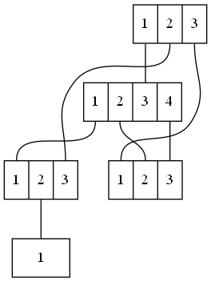

# STP Simulator

This is a Python application that simulates the spanning tree algorithm used to prevent loops in an Ethernet switched network.
The application reads a network representation as a DOT file, similar to the one shown below and produces an output showing the role and status of each port of the network switches.

The spanning tree algorithm is based on the description in *Radia Perlman. 1999. Interconnections (2nd ed.): bridges, routers, switches, and internetworking protocols. Addison-Wesley Longman Publishing Co., Inc., USA.*

## Known limitations

- Timing and timers are ignored. The simulation will run for x number of steps and produces the results. Make sure that simulation steps are sufficient for the STP to converge.
- A switch's self-loop is not handled correctly.

## Example Network

```
// A dot file of a 5-switch network
// Switches' shape and labels are useful for displaying the switch ports only,
// they have no effect on the simulation.

graph MG {
  node [shape=record]

  SW1 [label="<1>1|<2>2|<3>3" mac="00:00:00:00:00:01" priority=28672 xlabel=SW1]
  SW2 [label="<1>1|<2>2|<3>3|<4>4" mac="00:00:00:00:00:02" priority=32768 xlabel=SW2]
  SW3 [label="<1>1|<2>2|<3>3" mac="00:00:00:00:00:03" priority=32768 xlabel=SW3]
  SW4 [label="<1>1|<2>2|<3>3" mac="00:00:00:00:00:04" priority=32768 xlabel=SW4]
  SW5 [label="<1>1" mac="00:00:00:00:00:05" priority=32768 xlabel=SW5]

  SW1:1 -- SW2:3 [speed=1000];
  SW1:2 -- SW3:3 [speed=1000];
  SW1:3 -- SW4:1 [speed=1000];

  SW2:1 -- SW3:1 [speed=1000];
  SW2:2 -- SW4:2 [speed=1000];
  SW2:4 -- SW4:3 [speed=1000];

  SW3:2 -- SW5:1 [speed=1000];

}
```




## Installation

- clone this rpository
- Install required Python modules

## Usage

Run the application with a dot file as an input

```
>python3 stp_simulator.py -i testnet.dot
```

The output should be similar to this:

```
Bridge: SW1:
ID: 0x7000000000000001. This bridge is Root.
—————————————————————————————————————————————————————————————————
Port     Role            Status          Cost     Cost-to-Root
—————————————————————————————————————————————————————————————————
1        Designated      Forwarding      4        —
2        Designated      Forwarding      4        —
3        Designated      Forwarding      4        —

Bridge: SW2:
ID: 0x8000000000000002. Root ID: 0x8000000000000002.
—————————————————————————————————————————————————————————————————
Port     Role            Status          Cost     Cost-to-Root
—————————————————————————————————————————————————————————————————
1        Designated      Forwarding      4        —
2        Designated      Forwarding      4        —
3        Root Port       Forwarding      4        4
4        Designated      Forwarding      4        —

Bridge: SW3:
ID: 0x8000000000000003. Root ID: 0x8000000000000003.
—————————————————————————————————————————————————————————————————
Port     Role            Status          Cost     Cost-to-Root
—————————————————————————————————————————————————————————————————
1        Undesignated    Blocked         4        —
2        Designated      Forwarding      4        —
3        Root Port       Forwarding      4        4

Bridge: SW4:
ID: 0x8000000000000004. Root ID: 0x8000000000000004.
—————————————————————————————————————————————————————————————————
Port     Role            Status          Cost     Cost-to-Root
—————————————————————————————————————————————————————————————————
1        Root Port       Forwarding      4        4
2        Undesignated    Blocked         4        —
3        Undesignated    Blocked         4        —

Bridge: SW5:
ID: 0x8000000000000005. Root ID: 0x8000000000000005.
—————————————————————————————————————————————————————————————————
Port     Role            Status          Cost     Cost-to-Root
—————————————————————————————————————————————————————————————————
1        Root Port       Forwarding      4        8
```

A log file can be produced to show details:

```
>python3 stp_simulator.py -i testnet.dot -l DEBUG
```

Which prodcues:

```
INFO:root:Reading file: testnet.dot
INFO:root:Simulation starting.
DEBUG:root:Bridge 0x7000000000000001 boots.
DEBUG:root:Bridge 0x8000000000000002 boots.
DEBUG:root:Bridge 0x8000000000000003 boots.
DEBUG:root:Bridge 0x8000000000000004 boots.
DEBUG:root:Bridge 0x8000000000000005 boots.
DEBUG:root:Entering Step: 0
DEBUG:root:Bridge 0x7000000000000001 best BPDU is [0x7000000000000001, 0, 0x7000000000000001, 0] via port None.
DEBUG:root:Bridge 0x7000000000000001 is Root bridge.
DEBUG:root:Bridge 0x7000000000000001 sends BPDU [0x7000000000000001, 0, 0x7000000000000001, 1] via port 1.
DEBUG:root:Bridge 0x7000000000000001 sends BPDU [0x7000000000000001, 0, 0x7000000000000001, 2] via port 2.
DEBUG:root:Bridge 0x7000000000000001 sends BPDU [0x7000000000000001, 0, 0x7000000000000001, 3] via port 3.
DEBUG:root:Bridge 0x8000000000000002 best BPDU is [0x7000000000000001, 4, 0x8000000000000002, 3] via port 3.
DEBUG:root:Bridge 0x8000000000000002 sends BPDU [0x7000000000000001, 4, 0x8000000000000002, 3] via port 1.
DEBUG:root:Bridge 0x8000000000000002 sends BPDU [0x7000000000000001, 4, 0x8000000000000002, 3] via port 2.
DEBUG:root:Bridge 0x8000000000000002 sends BPDU [0x7000000000000001, 4, 0x8000000000000002, 3] via port 4.
DEBUG:root:Bridge 0x8000000000000003 best BPDU is [0x7000000000000001, 4, 0x8000000000000003, 3] via port 3.
DEBUG:root:Bridge 0x8000000000000003 sends BPDU [0x7000000000000001, 4, 0x8000000000000003, 3] via port 2.
DEBUG:root:Bridge 0x8000000000000004 best BPDU is [0x7000000000000001, 4, 0x8000000000000004, 1] via port 1.
DEBUG:root:Bridge 0x8000000000000005 best BPDU is [0x7000000000000001, 8, 0x8000000000000005, 1] via port 1.
DEBUG:root:Entering Step: 1
DEBUG:root:Bridge 0x7000000000000001 best BPDU is [0x7000000000000001, 0, 0x7000000000000001, 0] via port None.
DEBUG:root:Bridge 0x7000000000000001 is Root bridge.
DEBUG:root:Bridge 0x7000000000000001 sends BPDU [0x7000000000000001, 0, 0x7000000000000001, 1] via port 1.
DEBUG:root:Bridge 0x7000000000000001 sends BPDU [0x7000000000000001, 0, 0x7000000000000001, 2] via port 2.
DEBUG:root:Bridge 0x7000000000000001 sends BPDU [0x7000000000000001, 0, 0x7000000000000001, 3] via port 3.
DEBUG:root:Bridge 0x8000000000000002 best BPDU is [0x7000000000000001, 4, 0x8000000000000002, 3] via port 3.
DEBUG:root:Bridge 0x8000000000000002 sends BPDU [0x7000000000000001, 4, 0x8000000000000002, 3] via port 1.
DEBUG:root:Bridge 0x8000000000000002 sends BPDU [0x7000000000000001, 4, 0x8000000000000002, 3] via port 2.
DEBUG:root:Bridge 0x8000000000000002 sends BPDU [0x7000000000000001, 4, 0x8000000000000002, 3] via port 4.
DEBUG:root:Bridge 0x8000000000000003 best BPDU is [0x7000000000000001, 4, 0x8000000000000003, 3] via port 3.
DEBUG:root:Bridge 0x8000000000000003 sends BPDU [0x7000000000000001, 4, 0x8000000000000003, 3] via port 2.
DEBUG:root:Bridge 0x8000000000000004 best BPDU is [0x7000000000000001, 4, 0x8000000000000004, 1] via port 1.
DEBUG:root:Bridge 0x8000000000000005 best BPDU is [0x7000000000000001, 8, 0x8000000000000005, 1] via port 1.
DEBUG:root:Entering Step: 2
DEBUG:root:Bridge 0x7000000000000001 best BPDU is [0x7000000000000001, 0, 0x7000000000000001, 0] via port None.
DEBUG:root:Bridge 0x7000000000000001 is Root bridge.
DEBUG:root:Bridge 0x7000000000000001 sends BPDU [0x7000000000000001, 0, 0x7000000000000001, 1] via port 1.
DEBUG:root:Bridge 0x7000000000000001 sends BPDU [0x7000000000000001, 0, 0x7000000000000001, 2] via port 2.
DEBUG:root:Bridge 0x7000000000000001 sends BPDU [0x7000000000000001, 0, 0x7000000000000001, 3] via port 3.
DEBUG:root:Bridge 0x8000000000000002 best BPDU is [0x7000000000000001, 4, 0x8000000000000002, 3] via port 3.
DEBUG:root:Bridge 0x8000000000000002 sends BPDU [0x7000000000000001, 4, 0x8000000000000002, 3] via port 1.
DEBUG:root:Bridge 0x8000000000000002 sends BPDU [0x7000000000000001, 4, 0x8000000000000002, 3] via port 2.
DEBUG:root:Bridge 0x8000000000000002 sends BPDU [0x7000000000000001, 4, 0x8000000000000002, 3] via port 4.
DEBUG:root:Bridge 0x8000000000000003 best BPDU is [0x7000000000000001, 4, 0x8000000000000003, 3] via port 3.
DEBUG:root:Bridge 0x8000000000000003 sends BPDU [0x7000000000000001, 4, 0x8000000000000003, 3] via port 2.
DEBUG:root:Bridge 0x8000000000000004 best BPDU is [0x7000000000000001, 4, 0x8000000000000004, 1] via port 1.
DEBUG:root:Bridge 0x8000000000000005 best BPDU is [0x7000000000000001, 8, 0x8000000000000005, 1] via port 1.
DEBUG:root:Entering Step: 3
DEBUG:root:Bridge 0x7000000000000001 best BPDU is [0x7000000000000001, 0, 0x7000000000000001, 0] via port None.
DEBUG:root:Bridge 0x7000000000000001 is Root bridge.
DEBUG:root:Bridge 0x7000000000000001 sends BPDU [0x7000000000000001, 0, 0x7000000000000001, 1] via port 1.
DEBUG:root:Bridge 0x7000000000000001 sends BPDU [0x7000000000000001, 0, 0x7000000000000001, 2] via port 2.
DEBUG:root:Bridge 0x7000000000000001 sends BPDU [0x7000000000000001, 0, 0x7000000000000001, 3] via port 3.
DEBUG:root:Bridge 0x8000000000000002 best BPDU is [0x7000000000000001, 4, 0x8000000000000002, 3] via port 3.
DEBUG:root:Bridge 0x8000000000000002 sends BPDU [0x7000000000000001, 4, 0x8000000000000002, 3] via port 1.
DEBUG:root:Bridge 0x8000000000000002 sends BPDU [0x7000000000000001, 4, 0x8000000000000002, 3] via port 2.
DEBUG:root:Bridge 0x8000000000000002 sends BPDU [0x7000000000000001, 4, 0x8000000000000002, 3] via port 4.
DEBUG:root:Bridge 0x8000000000000003 best BPDU is [0x7000000000000001, 4, 0x8000000000000003, 3] via port 3.
DEBUG:root:Bridge 0x8000000000000003 sends BPDU [0x7000000000000001, 4, 0x8000000000000003, 3] via port 2.
DEBUG:root:Bridge 0x8000000000000004 best BPDU is [0x7000000000000001, 4, 0x8000000000000004, 1] via port 1.
DEBUG:root:Bridge 0x8000000000000005 best BPDU is [0x7000000000000001, 8, 0x8000000000000005, 1] via port 1.
DEBUG:root:Entering Step: 4
DEBUG:root:Bridge 0x7000000000000001 best BPDU is [0x7000000000000001, 0, 0x7000000000000001, 0] via port None.
DEBUG:root:Bridge 0x7000000000000001 is Root bridge.
DEBUG:root:Bridge 0x7000000000000001 sends BPDU [0x7000000000000001, 0, 0x7000000000000001, 1] via port 1.
DEBUG:root:Bridge 0x7000000000000001 sends BPDU [0x7000000000000001, 0, 0x7000000000000001, 2] via port 2.
DEBUG:root:Bridge 0x7000000000000001 sends BPDU [0x7000000000000001, 0, 0x7000000000000001, 3] via port 3.
DEBUG:root:Bridge 0x8000000000000002 best BPDU is [0x7000000000000001, 4, 0x8000000000000002, 3] via port 3.
DEBUG:root:Bridge 0x8000000000000002 sends BPDU [0x7000000000000001, 4, 0x8000000000000002, 3] via port 1.
DEBUG:root:Bridge 0x8000000000000002 sends BPDU [0x7000000000000001, 4, 0x8000000000000002, 3] via port 2.
DEBUG:root:Bridge 0x8000000000000002 sends BPDU [0x7000000000000001, 4, 0x8000000000000002, 3] via port 4.
DEBUG:root:Bridge 0x8000000000000003 best BPDU is [0x7000000000000001, 4, 0x8000000000000003, 3] via port 3.
DEBUG:root:Bridge 0x8000000000000003 sends BPDU [0x7000000000000001, 4, 0x8000000000000003, 3] via port 2.
DEBUG:root:Bridge 0x8000000000000004 best BPDU is [0x7000000000000001, 4, 0x8000000000000004, 1] via port 1.
DEBUG:root:Bridge 0x8000000000000005 best BPDU is [0x7000000000000001, 8, 0x8000000000000005, 1] via port 1.
INFO:root:Simulation completed.
```

The simulation steps should be proprtional to the size of the network to ensure that all switches receive the root's BPDU. Use the option '-s' to change the default number of steps (5):

```
>python3 stp_simulator.py -i testnet.dot -s 10
```
